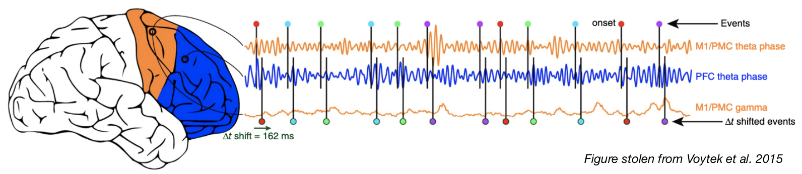

# COGS118C - Neural Signal Processing (UCSD)
Welcome to Neural Signal Processing.
This repo contains all the course material, including course documents, finished slides, and assignments starters.

+ Are you excited by the notion of controlling an exoskeleton with your brain signals?
+ Are you curious about the scientific pursuit of dissecting the neural basis of our minds?
+ Are you driven by creating consumer neurofeedback technologies that can improve our lives?
+ Or are you simply fascinated with decoding the brain as an extremely complex electrochemical system?

Learning how to analyze brain signals, as well as understanding their biological origins, are the first steps to accomplishing all of the above. Welcome to Neural Signal Processing (in Python).

See [syllabus](./Course Documents/Syllabus.pdf) for details.

---
### Guided Labs

If you're not taking this class at UCSD, the most useful part for you is probably the assignments. These are self-contained Jupyter Notebooks, and they walk through a progression of concepts that take you from the foundations of digital signal processing to more neuro-specific (and more advanced) techniques. They start with a lot of scaffolding, and slowly requires you to be more independent. Refer to the lecture slides (or Google) for additional clarifications, but I don't recommend reading the slides first for learning (because they are not very verbose).

- A0: Light review on Python, numpy, dot product, and complex numbers
- A1: Sampling and quantization of signals and time-locked analysis (ERP)
- A2: Code your own DFT algorithm from scratch (just dot product and complex numbers - easy!)
- A3: Time-frequency analysis via short-time Fourier transforms + introduction to filter design
- A4: Analytic signal (Hilbert Tranform) and spike-LFP analysis

---
