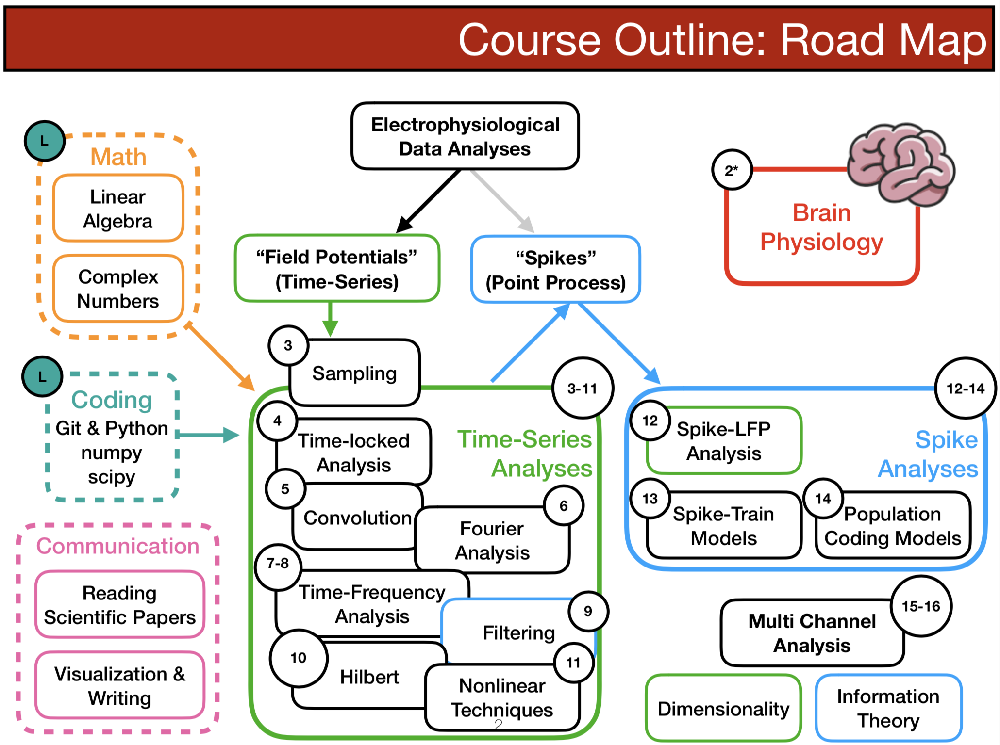

# Neural Signal Processing (UCSD COGS118C)
Welcome to Neural Signal Processing.
This repo contains all the course material, including course documents, finished slides in .pdf, and assignments.

+ Are you excited by the notion of controlling an exoskeleton with your brain signals?
+ Are you curious about the scientific pursuit of dissecting the neural basis of our minds?
+ Are you driven by creating consumer neurofeedback technologies that can improve our lives?
+ Or are you simply fascinated with decoding the brain as an extremely complex electrochemical system?

Learning how to analyze brain signals, as well as understanding their biological origins, are the first steps to accomplishing all of the above. Welcome to Neural Signal Processing (in Python).

See [syllabus](CourseDocuments/Syllabus.pdf) for details.

---
## Guided Labs

If you're not taking this class at UCSD, the most useful part for you is probably the [assignments](Assignments). These are self-contained Jupyter Notebooks, and they walk through a progression of concepts that take you from the foundations of digital signal processing to more neuro-specific (and more advanced) techniques. They start with a lot of scaffolding, and slowly require you to be more independent. Refer to the lecture slides (or Google) for additional clarifications, but I don't recommend reading the slides first for learning because they are not very verbose.

- [A0](Assignments/A0-LinAlgComplex.ipynb): Light review on Python, numpy, dot product, and complex numbers
- [A1](Assignments/A1-SamplingTimeSeries.ipynb): Sampling + digitization of signals, and time-locked analysis (ERP)
- [A2](Assignments/A2-FourierTransform.ipynb): Code your own Discrete Fourier Transform from scratch (just dot product and complex numbers - easy!)
- [A3](Assignments/A3-TimeFrequencyFiltering.ipynb): Time-frequency analysis via short-time Fourier transforms + introduction to filter design
- [A4](Assignments/A4-HilbertLFPSpike.ipynb): Analytic signal (Hilbert Tranform), cross-frequency coupling, and spike-LFP analysis

---

## Previous Student Projects

Student projects from Summer Session 1, 2019 (with their permission to share). These are done using publicly available datasets (see [here](/Assignments/project_data/data_curation.ipynb), with minor curation from me, as well as data they found/recorded on their own.

**Anesthesia-Induced Transition in Monkey ECoG**

[Group 1](https://github.com/vnazlukhanyan/COGS118C_Final/blob/master/Oscillatory_Basis_Project.ipynb) | [Group 2](https://github.com/kevinice95/Cogs118C-final) | [Group 3](https://github.com/dylew898/Cogs118Project) | [Group 4](https://github.com/ahsanbari/Cogs118C_Final_Prj) | [Group 5](https://github.com/Chuyang98/COGS-118C-Final-Project-Code-and-Slide) | [Group 6](https://github.com/ZhuojunChen/COGS118C/blob/master/Assignments/project_data/COGS118C-Final-Presentation-Monkey-Data-Analysis.ipynb)

**Decoding Finger Movement from Human ECoG**

[Group 7](https://github.com/benjaminmakowsky/cogs118c/blob/master/Assignments/Final%20Project.ipynb) | [Group 8](https://github.com/yuhaimei/COGS__118C_Final_Project)

**Fear & Expectation ERP with MUSE EEG**

[Group 9](https://github.com/TamuzHod/Neural-_signal_processing_final_project)

**Improving SSVEP Decoding via Baselining**

[Group 10](https://github.com/Nikleon/AR-Modeling-EEG-for-SSVEP/blob/master/FinalProjectReport.ipynb)
